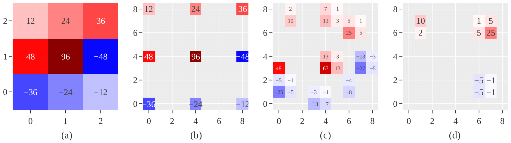

[](https://arxiv.org/abs/2112.03740v3)
# Dilated-Convolution-with-Learnable-Spacings-PyTorch

<div align=center>

</div>

This is an official implementation of [Dilated Convolution with Learnable Spacings](https://arxiv.org/abs/2112.03740v3) by Ismail Khalfaoui Hassani, Thomas Pellegrini and Timothée Masquelier.

Dilated Convolution with Learnable Spacings (abbreviated to DCLS) is a novel convolution method based on gradient descent and interpolation. It could be seen as an improvement of the well known dilated convolution that has been widely explored in deep convolutional neural networks and which aims to inflate the convolutional kernel by inserting spaces between the kernel elements. 

In DCLS, the positions of the weights within the convolutional kernel are learned in a gradient-based manner, and the inherent problem of non-differentiability due to the integer nature of the positions in the kernel is solved by taking advantage of an interpolation method. 

For now, the code has only been implemented on [PyTorch](https://pytorch.org/), using Pytorch. 

- [What's new](#whats-new)
- [Installation](#installation)
- [Usage](#usage)
- [Device Supports](#device-supports)
- [Publications and Citation](#publications-and-citation)
- [Contribution](#contribution)

The method is described in the arXiv preprint [Dilated Convolution with Learnable Spacings](https://arxiv.org/abs/2112.03740v3).

## What's new

**Jan 7, 2023**:
-   Important modification to ConstructKernel{1,2,3}d algorithm which allows to use less memory, this modification enables very large kernel counts. For example:
```python
from DCLS.construct.modules import  Dcls2d

m = Dcls2d(96, 96, kernel_count=2000, dilated_kernel_size=7, padding=3, groups=96).cuda() 
```
After installation of the new version 0.0.3 of DCLS, the use remains unchanged. 

**Nov 8, 2022**:
-   Previous branch main is moved to branch cuda, now in main branch we have fully native torch conv{1,2,3}d.

**Sep 27, 2022**:
-   Code release for ConvNeXt-dcls experiments. See [**ConvNeXt-dcls**](https://github.com/K-H-Ismail/ConvNeXt-dcls).

## Installation

DCLS is based on PyTorch and CUDA. Please make sure that you have installed all the requirements before you install DCLS.

**Requirements**:
-   Pytorch version torch>=1.6.0. See [**torch**](https://pytorch.org/).

**Preferred versions**:
```bash
pip3 install torch==1.8.0+cu111 torchvision==0.9.0+cu111 -f https://download.pytorch.org/whl/torch_stable.html
```

**Install the latest developing version from the source codes**:

From [GitHub](https://github.com/K-H-Ismail/Dilated-Convolution-with-Learnable-Spacings-PyTorch):
```bash
git clone https://github.com/K-H-Ismail/Dilated-Convolution-with-Learnable-Spacings-PyTorch.git
cd Dilated-Convolution-with-Learnable-Spacings-PyTorch
python3 -m pip install --upgrade pip
python3 -m build 
python3 -m pip install dist/dcls-0.0.2-py3-none-any.whl 

```

**Install the last stable version from** [**PyPI**](https://pypi.org/project/DCLS/):

```bash
pip3 install dcls
```

## Usage
Dcls methods could be easily used as a substitue of Pytorch's nn.Conv**n**d classical convolution method:

```python
import torch
from DCLS.construct.modules import  Dcls2d

# With square kernels, equal stride and dilation
m = Dcls2d(16, 33, kernel_count=3, dilated_kernel_size=7)
input = torch.randn(20, 16, 50, 100)
output = m(input)
loss = output.sum()
loss.backward()
print(output, m.weight.grad, m.P.grad)
```
A typical use is with the separable convolution

```python
import torch
from DCLS.construct.modules import  Dcls2d

m = Dcls2d(96, 96, kernel_count=34, dilated_kernel_size=17, padding=8, groups=96)
input = torch.randn(128, 96, 56, 56)
output = m(input)
loss = output.sum()
loss.backward()
print(output, m.weight.grad, m.P.grad)
```

Dcls with different dimensions 
```python
import torch
from DCLS.construct.modules import  Dcls1d 

# Will construct kernels of size 7x7 with 3 elements inside each kernel
m = Dcls1d(3, 16, kernel_count=3, dilated_kernel_size=7)
input = torch.rand(8, 3, 32)
output = m(input)
loss = output.sum()
loss.backward()
print(output, m.weight.grad, m.P.grad)
```

```python
import torch
from DCLS.construct.modules import  Dcls3d

m = Dcls3d(16, 33, kernel_count=10, dilated_kernel_size=(7,8,9))
input = torch.randn(20, 16, 50, 100, 30)
output = m(input)
loss = output.sum()
loss.backward()
print(output, m.weight.grad, m.P.grad)
```

**DepthWiseConv2dImplicitGEMM for 2D-DCLS**:

For 2D-DCLS, to install and enable the DepthWiseConv2dImplicitGEMM, please follow the instructions of [RepLKNet](https://github.com/DingXiaoH/RepLKNet-pytorch#use-our-efficient-large-kernel-convolution-with-pytorch). Otherwise, Pytorch's native Conv2D method will be used.


## Device Supports
DCLS supports CPU and Nvidia CUDA GPU devices now.

-   [x] Nvidia GPU
-   [x] CPU

Make sure to have your data and model on CUDA GPU.

## Publications and Citation

If you use DCLS in your work, please consider to cite it as follows:

```
@article{khalfaoui2021dilated,
  title={Dilated convolution with learnable spacings},
  author={Khalfaoui-Hassani, Ismail and Pellegrini, Thomas and Masquelier, Timoth{\'e}e},
  journal={arXiv preprint arXiv:2112.03740},
  year={2021}
}

```

## Contribution

This project is open source, therefore all your contributions are welcomed, whether it's reporting issues, finding and fixing bugs, requesting new features, and sending pull requests ...


